# Kali Linux Installation

This tutorial assumes that you are able to boot the installation media inside a virtual machine (VM) to install Kali Linux.  
Despite it being easier to use the pre-built VMs, we recommend that you use the installation media, as it will allow you to learn more about the process of installing operating systems.
The following options can be adjusted as you see fit.

## Obtain installation media

If you do not have an installation media for Kali Linux, like a disc image, you can obtain one [here](https://cdimage.kali.org/).  
Make sure you download the desired version and the correct processor architecture (for Apple Silicon MacBooks, ARM64, for Intel-based MacBooks, AMD64).

## Installation steps inside VM

1. Your VM should now be loading.
Select the “Install” option using your keyboard.

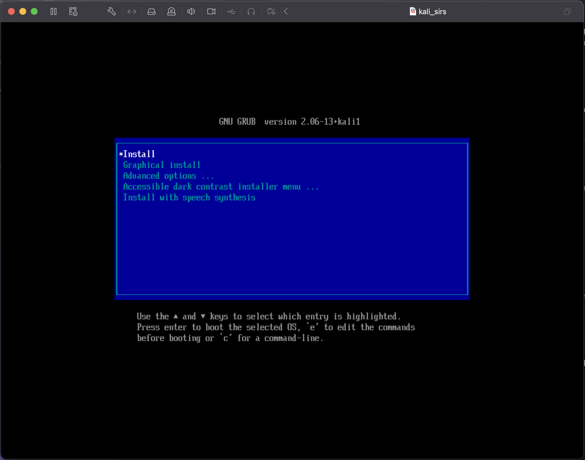

2. After a while, you will be presented with a screen which allows you to select a language.
For the purpose of this guide, we will select “English”.

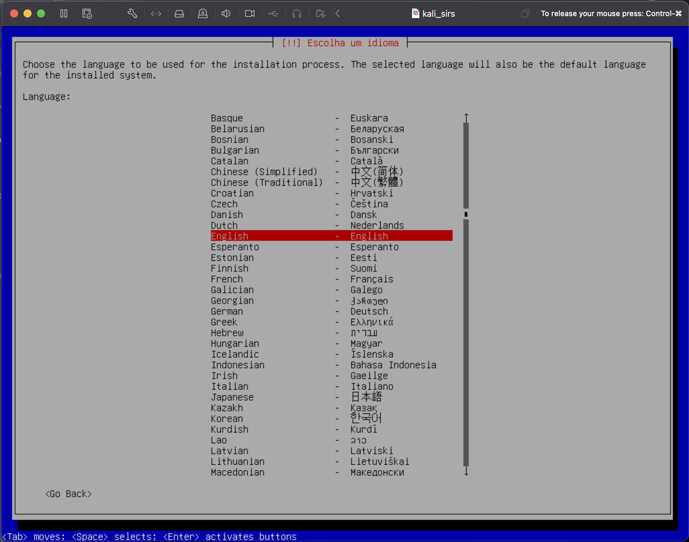

3. Select “Other” location, "Europe", "Portugal".

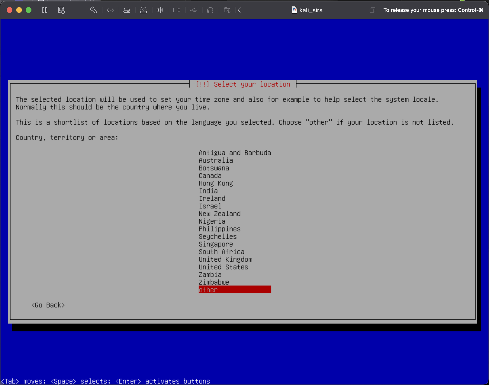

4. Select “United States” locale.

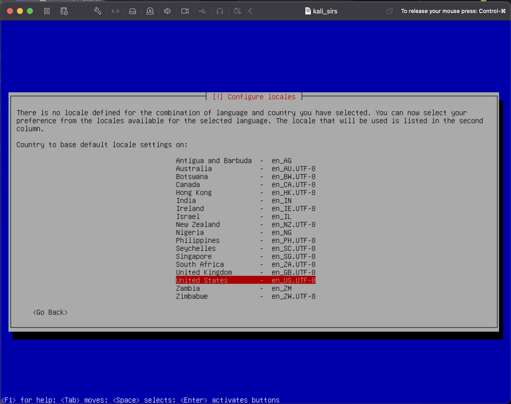

5. Select “Portuguese” keyboard layout.

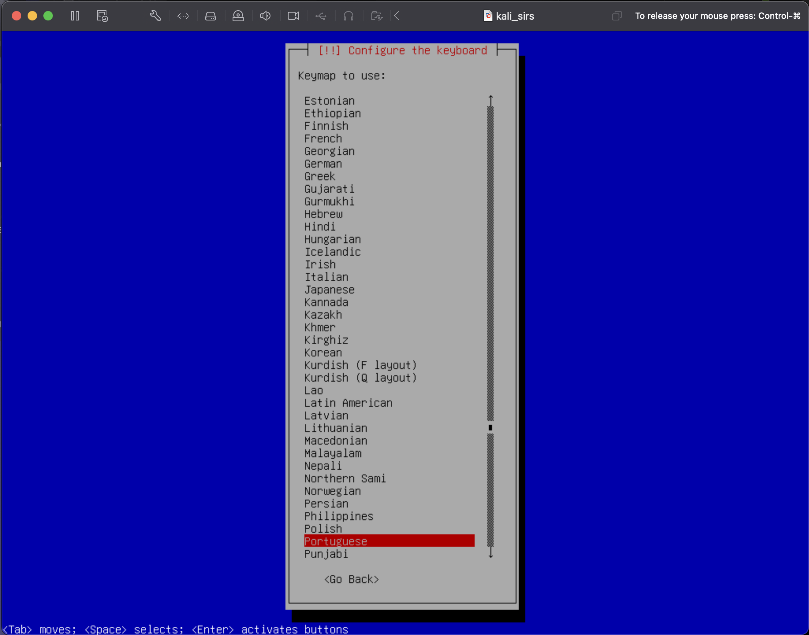

6. Set hostname as “kali”, the default value.

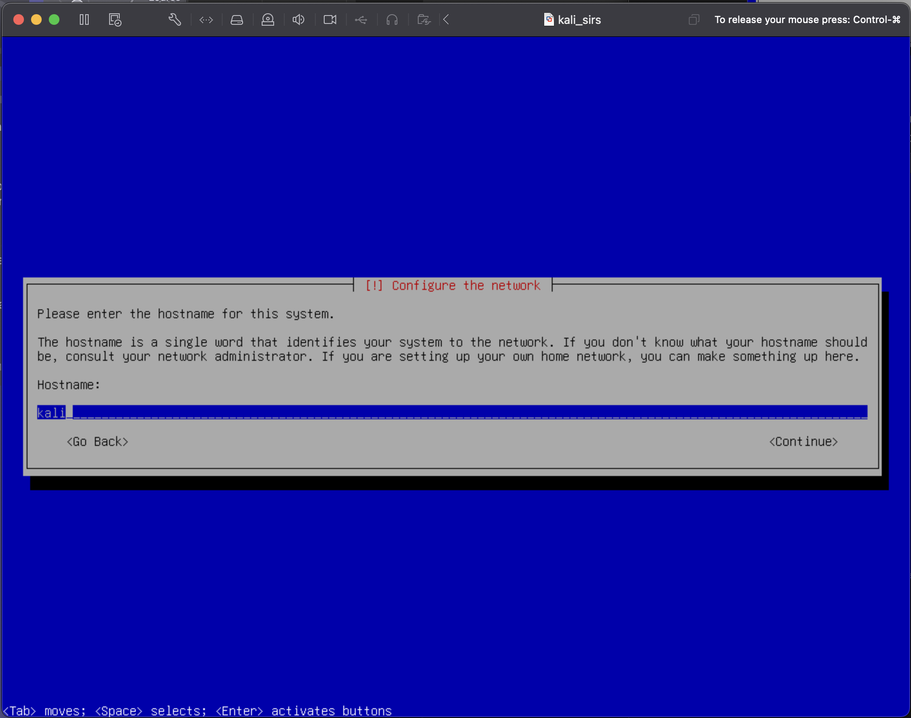

7. You can skip the definition of domain name.

8. Username and password will be set to “kali” for this example.
This is an insecure practice, so make sure you select another password (that you do not forget).

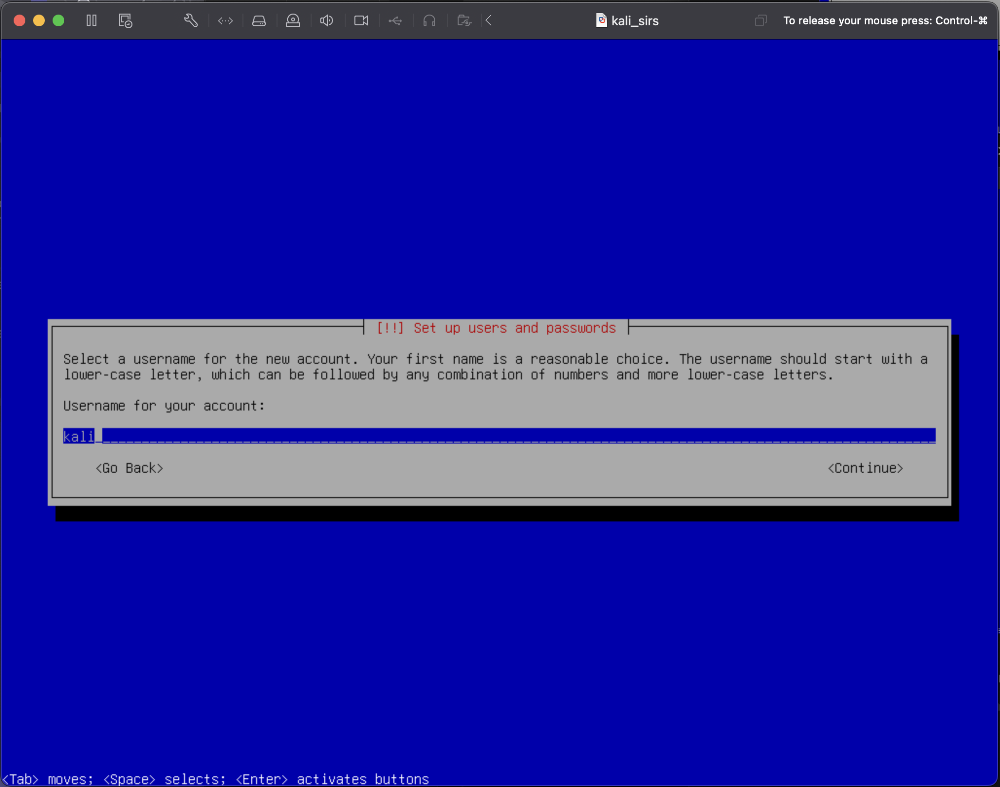

9. Set your timezone as “Lisbon”

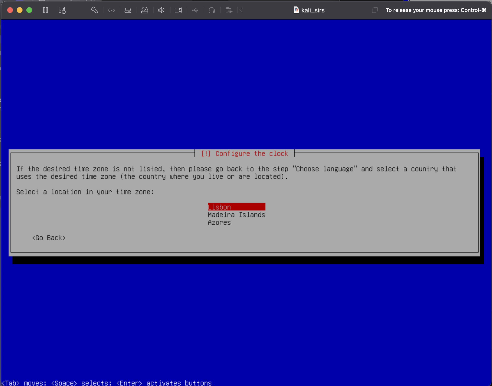

10. Select “Guided - use entire disk”, and for the following option, you should select the only existing disk, “VMWare Virtual NVMe Disk”

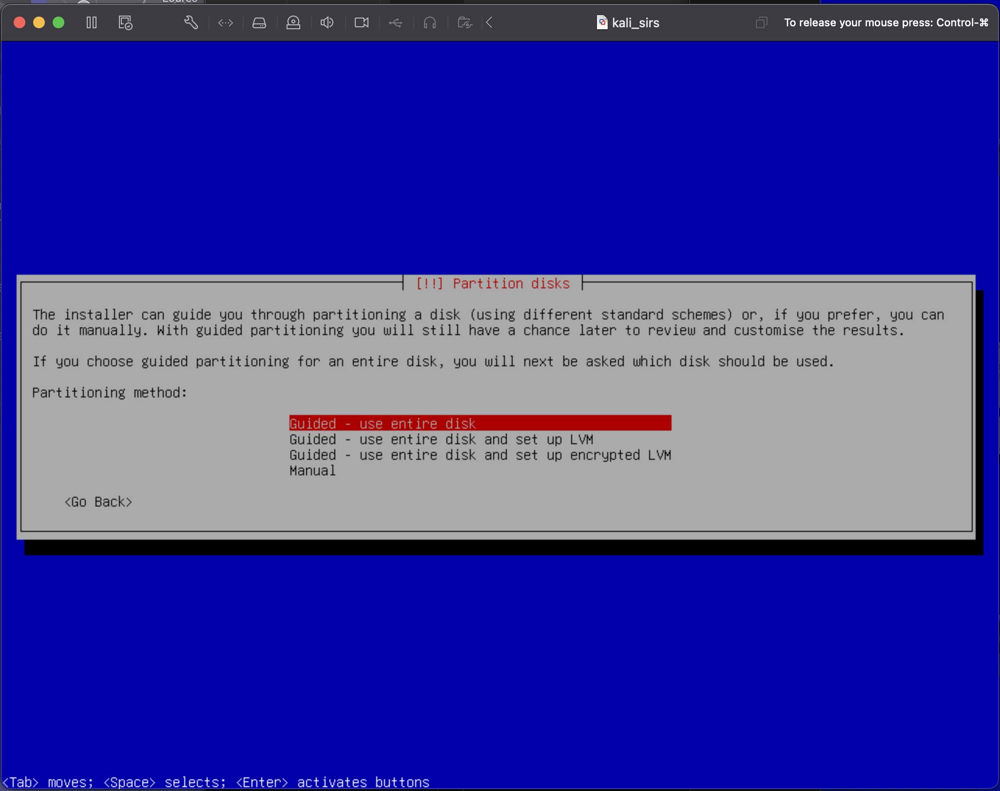

11. Select “All files in one partition”

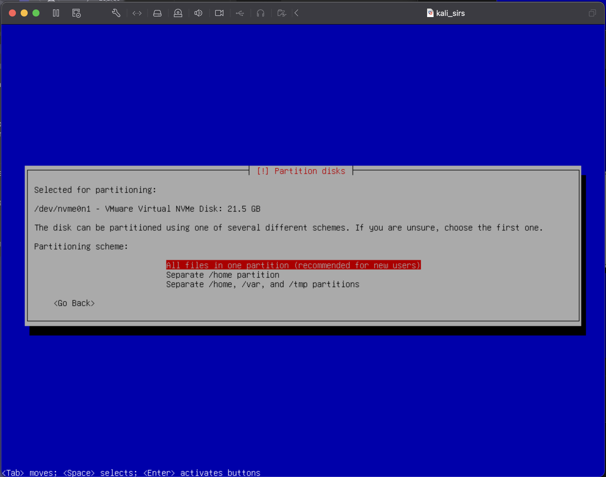

12. Select “Finish partitioning” and confirm your changes by selecting “Yes”

After a short while, the installer should ask you which software you want.

13. For desktop environment, you should choose Xfce, Kali’s default.

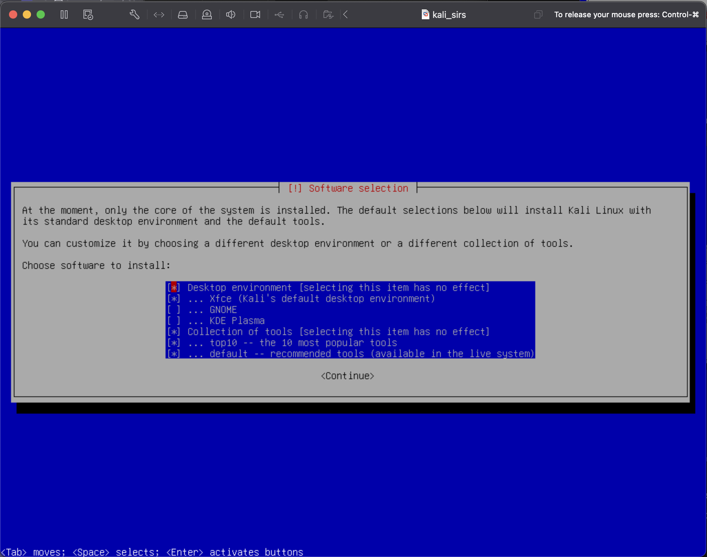

As the installer prepares your Kali Linux instance, you will have to wait for a short while, around 10 minutes.

14. Select “Continue” to finish the installation.

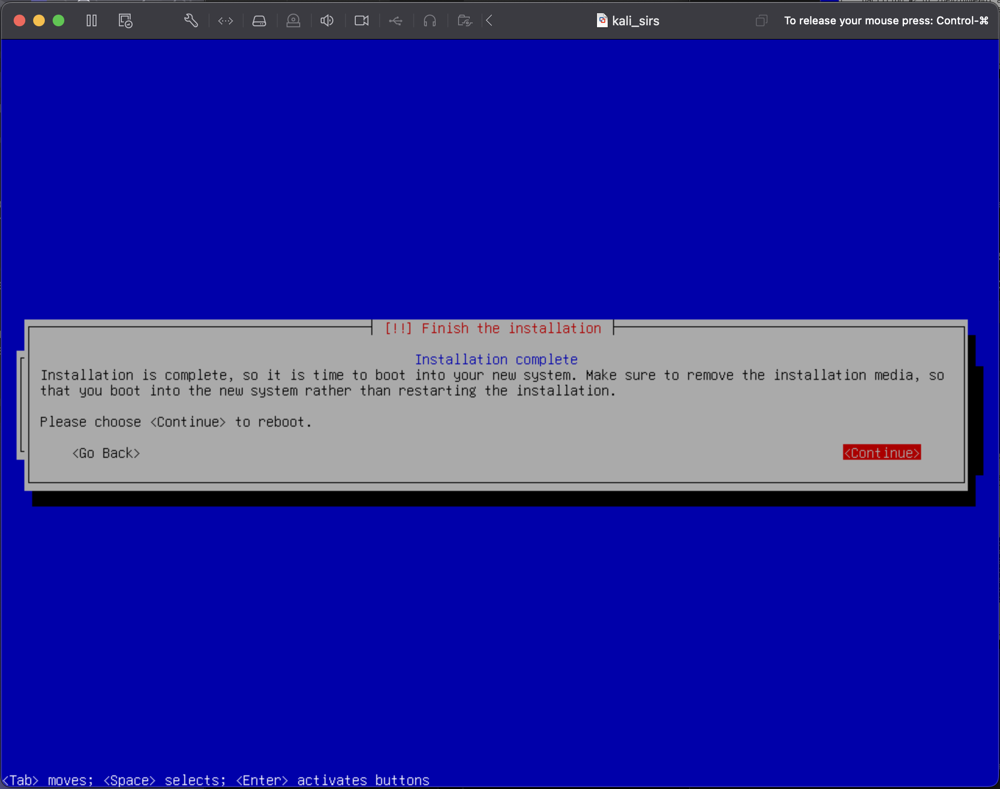

15. After a while, you should be presented with a login screen, in which you should use the username and password that you previously configured.

## Kali up and running

Kali Linux is installed and ready for use!

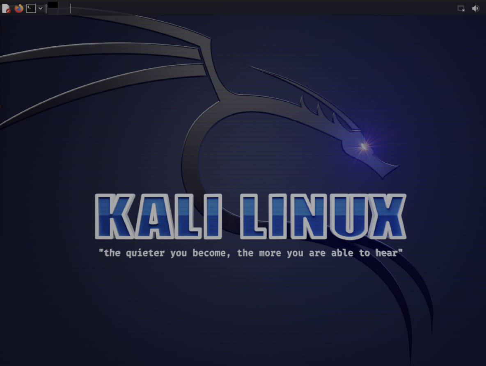

<!--
If you wish to remove the graphical user interface, you can follow [these instructions](https://linuxconfig.org/kali-linux-without-gui).
-->

----

[SIRS Faculty](mailto:meic-sirs@disciplinas.tecnico.ulisboa.pt)
