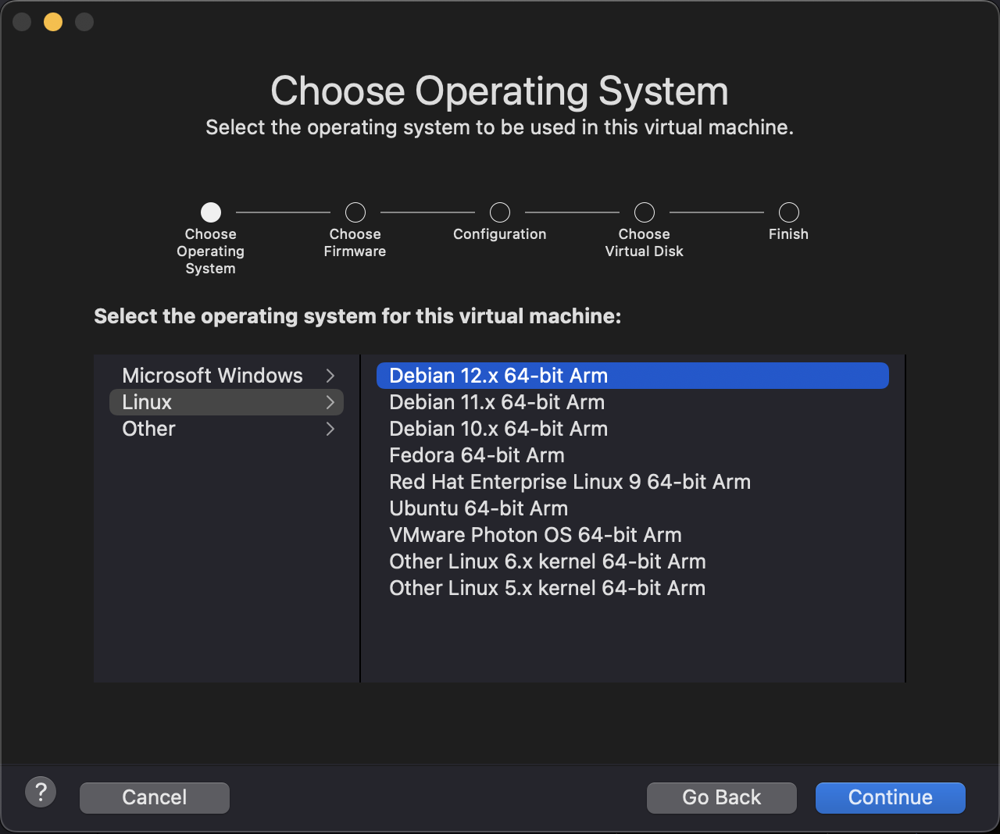
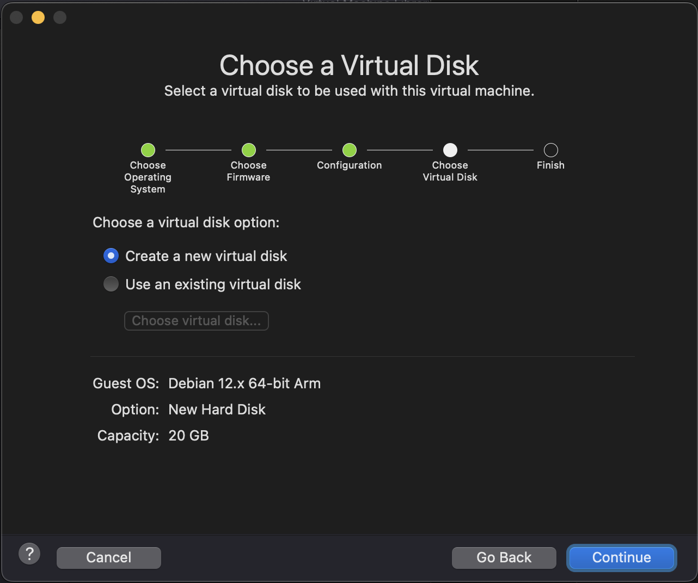
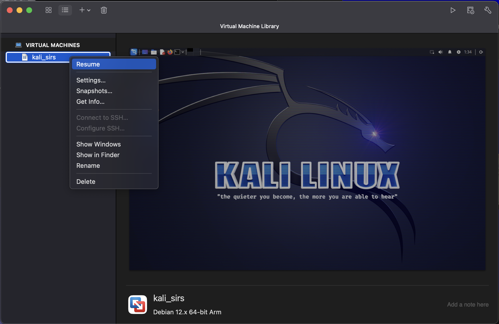

# VMware Fusion 13

## Installation and VM Setup Guide

This guide will walk you through the process of installing VMware Fusion 13 and setting up a VM for the lab classes.
This guide is intended for users of both Intel-based and Apple Silicon MacBooks, though there are some minor differences between the two, which will be noted when relevant.
Recently, VMWare Fusion has been replaced with VMWare Fusion **Pro** as the freely available version for personal use (VMWare Workstation Pro too). You can choose either version 13.6 (latest as of writing) or 13.5.2.

### 1. Obtaining VMware Fusion

VMware allows anyone to obtain a personal-use license of VMware Fusion, which is some of the most capable virtualization software currently available for macOS, with the added benefit of supporting Apple Silicon devices.
Follow these steps to obtain a copy of VMware Fusion:

- Visit [this page](https://profile.broadcom.com/web/registration) to create a free VMware account;
- Complete your registration and login with your newly created account;
- After logging in (skip the "Build your profile" part), visit [this page](https://support.broadcom.com/group/ecx/productdownloads?subfamily=VMware+Fusion);
- Select VMware Fusion **Pro** and then choose either version 13.6 or 13.5.2 (the same package works for both Intel and Apple Silicon MacBooks);
- Open the downloaded binary and follow the instructions.
When prompted, make sure to allow “Accessibility” permissions for VMware Fusion;
- Open VMware Fusion for the first time and accept any permission prompts required for usage.
When prompted to insert a license or freely for personal use, choose the latter.

### 2. Setting up a VM for the lab classes

There are two ways to go about this.
You can either download a Kali Linux installer and configure the VM from scratch (section 2.1), or you can download a pre-built VMware image, which features a pre-configured instance of Kali Linux 2023.3 (section 2.2).
Despite it being easier to use the pre-built VMs, we recommend that you use the installation media.

### 2.1. Creating a VM using the installation media

This section is largely similar for users of Intel-based and Apple Silicon MacBooks, with the only difference being the OS installer to use:

- For Apple Silicon MacBooks, you should download the ARM64 installer, available [here](https://cdimage.kali.org/kali-2023.3/kali-linux-2023.3-installer-arm64.iso);
- For Intel-based MacBooks, you should download the AMD64 installer, available [here](https://cdimage.kali.org/kali-2023.3/kali-linux-2023.3-installer-amd64.iso).

When your ISO file is ready, follow these instructions to configure your VM:

1. Click the VMware Fusion icon on the menu bar and click “Virtual Machine Library” to open the main VMware Fusion window.

2. Create a new virtual machine.

3. Select “Install from disc or image” and continue.

4. At this point, you should drag your ISO file into this window or select it manually and continue.

5. Select “Linux”, “Debian 12.x 64-bit Arm” if you are on Apple Silicon, or “Debian 12.x 64-bit” if you are on an Intel-based MacBook and continue.

6. Select “Create a new virtual disk” and continue.
The default is 20 GB, though this is a dynamic value, it will not instantly allocate 20GB of space unless the VM uses that much space.
It is also configurable later on.

7. Select “Finish”.

At the saving screen, we recommend saving in the default location, which should the the “Virtual Machines” folder.
You should change the default name to something such as “kali_sirs” or just “kali”.

8. Your VM should now be loading.

9. **Now follow all the instructions for [Kali Linux Installation](KaliSetup.md)**.

10. Now, you can either power-off your VM (via the power menu within Kali), or simply close to exit the VM’s window, which will suspend it.
You can resume it anytime later on by right-clicking it and selecting “Resume” on the virtual-machine library.

----

### 2.2. Creating a VM using the pre-built image

This is an alternative to the recommended 2.1 installation.

This section is also largely similar for users of Intel-based and Apple Silicon MacBooks, with the only difference being the pre-built VMware image to use.

- For Apple Silicon MacBooks, you can use an image we have made available [here](https://drive.google.com/file/d/1qnLF5P1cCqGZosv8zwT40ijJ7OIg1_oe/view?usp=sharing).
- For Intel-based MacBooks, you can use Kali’s own pre-built VMware image, available [here](https://cdimage.kali.org/kali-2023.3/kali-linux-2023.3-vmware-amd64.7z).

Once you have downloaded your image, you should extract the compressed file to find a `.vmwarevm` file, which you should place at *<username>/Virtual Machines*.
This folder will exist only if you have opened VMware Fusion at least once.
If you have trouble finding it, a good reference point is that it is a sibling folder of others such as *************Applications*************, *********Documents********* and *********Downloads*********.

After doing this, click the VMware Fusion icon on the menu bar and click “Virtual Machine Library” to open the main VMware Fusion window.
Use the “Scan” option, as detailed below.

This should cause a new VM to show up on the list.
Right-click it and hit “Start Up”.
Some popups may appear now, and you should respond as follows:

- If you see a popup saying “This virtual machine appears to be in use”, click the “Take Ownership” button;
- When you see a popup saying “This virtual machine might have been moved or copied”, click the “I Copied It” option.

At this point, your VM should be ready to use, and you can log-in with the following credentials:

- Username: `kali`
- Password: `kali`

## Troubleshooting

If you have any issues with this guide, due to the granularity myriad of possible issues, we urge you to search online for people with similar issues, as it is likely that you will find a solution to your problem.

For issues or any additional questions, please feel free to reach out to your labs instructor in-class, or to the faculty via e-mail.

----

[SIRS Faculty](mailto:meic-sirs@disciplinas.tecnico.ulisboa.pt)
